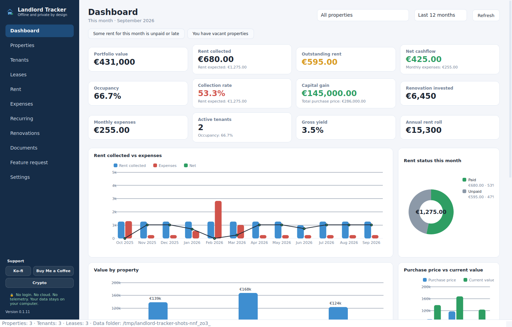

# Landlord Tracker

**Free forever. Offline. Private.** A rental property tracker for small landlords who
have outgrown a spreadsheet but do not want a monthly subscription or their tenants'
data sitting in someone else's cloud.

No account. No sign-up. No server. No telemetry. Your data lives in one SQLite file
on your own computer, and nothing ever leaves it.



## What it does

- **Properties** — purchase price, current value, monthly rent, capital gain, gross yield.
- **Tenants & leases** — contact details, lease start/end, deposit, rent, due day,
  and automatic "expiring soon" flags so you never miss a renewal.
- **Rent ledger** — log each payment as paid, partial or unpaid. Status, arrears and
  collection rate are worked out for you. One button generates the month from your
  active leases.
- **Expenses** — mortgage, insurance, repairs, management fees, taxes — per property
  and per category.
- **Renovations with payback** — log what you spent, the monthly rent uplift it
  produced, and get the payback period in months. If you have not seen the uplift
  yet, it says so instead of inventing a number.
- **Documents** — attach leases, invoices and certificates. They are *copied* into a
  local vault; your originals are never touched.
- **Exports and imports** — a formatted multi-sheet `.xlsx` export for your accountant,
  plus an Excel import template for properties, tenants and leases so you can load
  existing records without typing them one by one.
- **Local backups** — one ZIP containing the database and every document.
- **Graphs that answer questions** — cashflow over time, rent status, value by
  property, purchase vs current value, expenses by category, most profitable property.

Available in **English and Portuguese (pt-PT)**, switchable without restarting, with
correct currency formatting for each locale.

## Install

Download the latest `.tar.gz` from the [Releases page](../../releases/latest),
unpack it, and run one command:

```bash
tar -xzf landlord-tracker-*.tar.gz
cd landlord-tracker-*/
./install.sh
```

That is the whole process. It installs into your home folder, creates a private
Python environment, adds a menu entry, and never needs root (unless `python3-venv`
is missing, in which case it asks for your password once to install it).

Then launch **Landlord Tracker** from your application menu.

To remove it:

```bash
./uninstall.sh            # keeps your data
./uninstall.sh --purge    # removes everything
```

### Requirements

Python 3.10+ and a normal Linux desktop (tested on Ubuntu 24.04, GNOME/Wayland).
PySide6 and openpyxl are installed automatically into a private virtual environment.

## Where your data lives

```
~/.local/share/landlord-tracker/landlord.db      # one SQLite file, everything in it
~/.local/share/landlord-tracker/documents/       # copies of your attached files
~/.local/share/landlord-tracker/backups/         # ZIP backups you create
```

Back up that folder and you have backed up the entire application. Copy it to a new
machine and everything is there.

## Free forever

Every feature is included. There is no pro tier, no feature unlocks, no ads, and no
limit on the number of properties, tenants or leases.

If it saves you money or time, you can support development — entirely optional:

- Ko-fi: https://ko-fi.com/snatner1337
- Buy Me a Coffee: https://buymeacoffee.com/snatner
- GitHub Sponsors: see the repository

## Found a bug, or want a feature?

Use **Feature request** inside the app: write it, add your email if you want a reply,
and it opens a pre-filled email or a GitHub issue. Nothing is sent automatically —
you press send.

## Licence

GPL-3.0-or-later. Use it, study it, change it, share it. If you distribute a modified
version, it stays free for everyone else too.

## For developers

```bash
python3 -m venv .venv && . .venv/bin/activate
pip install -e ".[dev]"
QT_QPA_PLATFORM=offscreen pytest          # run the suite
QT_QPA_PLATFORM=offscreen python scripts/screenshots.py
python -m landlord_tracker
```

Layout: `src/landlord_tracker/db.py` (SQLite), `services/` (calculations, dashboard,
exports, backups, formatting), `ui/` (views, widgets, theme), `resources/locale/*.json`
(translations — add a language by copying `en.json`).
